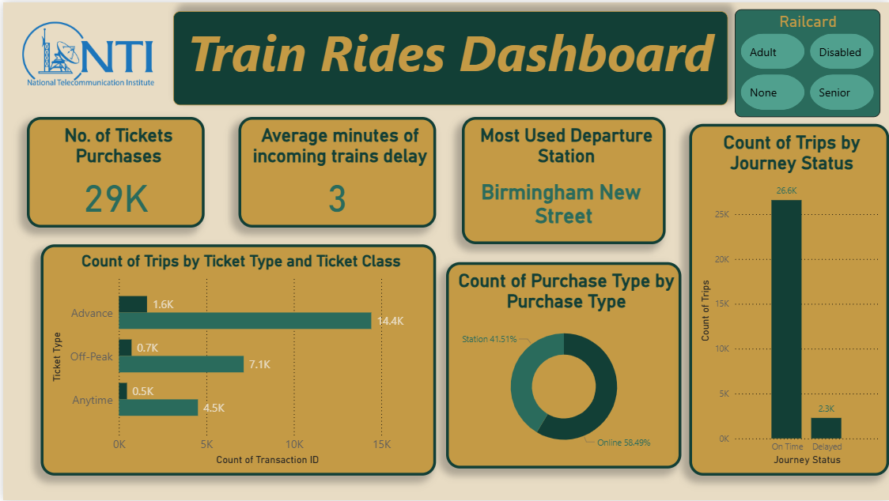

from pathlib import Path

readme = """# 🚆 UK Train Rides – Power BI Dashboard

A Power BI data visualization project based on a UK train ticket transactions dataset.

The project focuses on understanding train demand, ticket purchases, journey patterns, and station usage through interactive Power BI dashboards.

## 📊 Project Overview

The dataset contains information about:

- Ticket and purchase details
- Ticket class and ticket type
- Railcard usage
- Departure stations
- Arrival destinations
- Journey dates and times
- Journey status
- Journey duration
- Train delays
- Payment and refund information

The project was completed as part of a larger data analysis project where the same dataset was analyzed using different tools, including Excel, Power BI, Tableau, Python, and Machine Learning. fileciteturn3file0L5-L15

## 🛠️ Tools Used

- **Power BI** – Data cleaning, modeling, DAX measures, and dashboard creation
- **Power Query** – Data preparation and calculated columns
- **DAX** – Measures and KPI calculations
- **Excel** – Supporting data analysis
- **Tableau** – Additional visualization
- **Python** – Data analysis and visualization
- **Machine Learning** – Train delay prediction

## 🔄 Power BI Process

### 1. Data Cleaning

The dataset was prepared in Power Query. Most of the data was already clean, but the time columns needed to be converted to the correct time format. Some invalid/negative time values caused conversion errors, so the affected rows were removed. fileciteturn3file0L70-L75

### 2. Feature Engineering

New columns were created to support the analysis:

- **Journey Duration** – calculated from the journey start and end times
- **Delay Duration** – calculated using the actual arrival time and scheduled arrival time

DAX measures were also created for:

- Average delay
- Total number of trips
- Average time between purchase and journey date

A date table was also used for the time-based analysis. fileciteturn3file0L76-L84

## 📈 Dashboard 1 – Train Rides Dashboard

The first dashboard focuses on overall ticket purchases and journey behavior.

### Key KPIs

- **Total Tickets:** 29K
- **Average minutes of incoming train delay:** 3
- **Most Used Departure Station:** Birmingham New Street

### Visualizations

- Count of trips by ticket type and ticket class
- Purchase type distribution
- Trips by journey status
- Ticket and journey-related KPIs
- Railcard filters



## 📍 Dashboard 2 – Demand on Station

The second dashboard focuses on station demand and journey patterns.

It includes:

- Trips by day name
- Trips by day
- Trips by month
- Trips by month and purchase type
- Departure station filter
- Arrival destination filter


## 💡 Main Insights

The Power BI analysis was designed to make important demand and journey patterns easier to understand.

Some of the main areas explored were:

- Which stations have the highest number of trips
- How trip volume changes across days and months
- Which ticket types and classes are used most
- How passengers purchase their tickets
- How journey status affects overall trip counts
- Average train delay and booking lead time

The wider project also identified Manchester Piccadilly → Liverpool Lime Street as the highest-volume route with 4,628 trips and found that 86.8% of scheduled trips were classified as On Time. fileciteturn3file0L184-L197

## 📁 Project Files

A suggested GitHub structure for this project is:

```text
UK-Train-Rides-PowerBI/
│
├── README.md
│
├── PowerBI/
│   └── Train_Rides_Dashboard.pbix
│
├── Data/
│   └── train_ticket_data.csv
│
├── Documentation/
│   └── Team_6_Documentation.pdf
│
├── Screenshots/
│   ├── train-rides-dashboard.png
│   └── demand-on-station.png
│
├── Excel/
│   └── train_analysis.xlsx
│
├── Python/
│   └── train_analysis.ipynb
│
└── Tableau/
    └── train_dashboard.twbx
